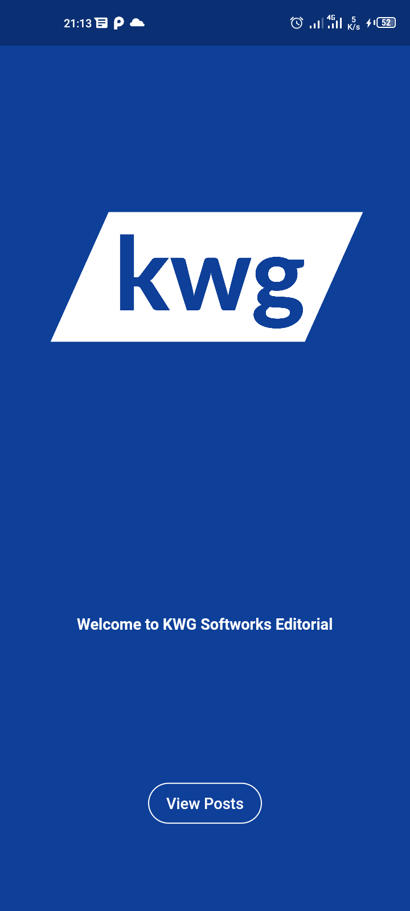
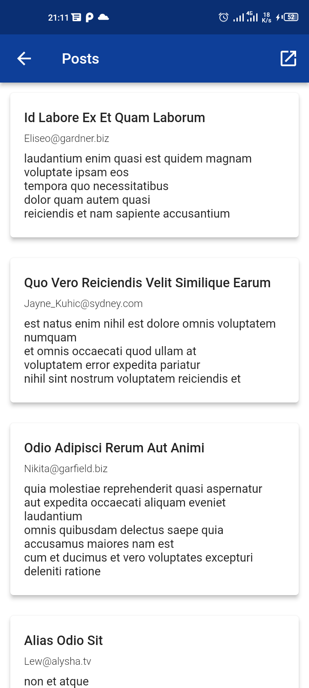
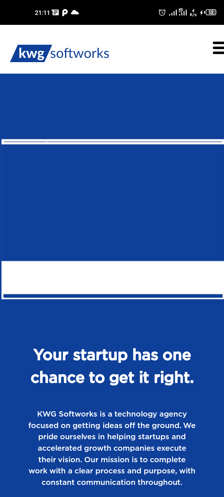

# kwgsoftworks

[APK Release](https://github.com/ChegeBryan/kwgsoftworks-app/releases)

## Getting Started

#### Requirements

1. Flutter SDK 2.5.3

#### Run the project

1. Clone the project to your local machine
2. Navigate to the project folder and launch a terminal instance on the folder root.
3. Install dependencies, run `flutter pub get`
4. Build the apk `flutter build apk`
5. Install to the connected Android phone, run `flutter install`

### Screenshots

 

 

